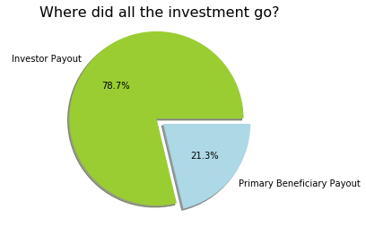
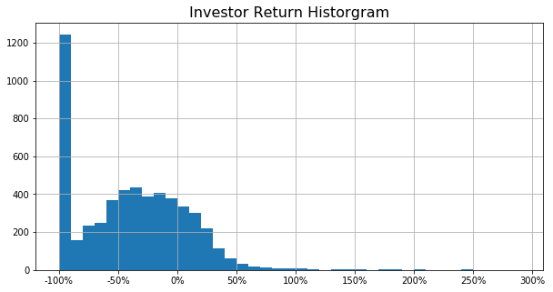
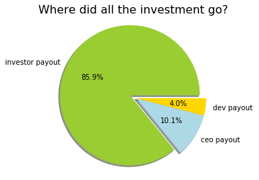
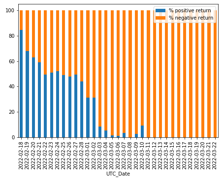

# Daily ROI Smart Contracts Analysis
On-chain analytics on some of the daily ROI contracts on fantom and polygon networks. #on-chain-analytics #daily-roi #smart-contract #ftmscan #polygonscan

<!-- ABOUT THE PROJECT -->
## About The Project

A quick peek at DappRadar shows that there are quite a few daily ROI DApps on [polygon](https://dappradar.com/rankings/protocol/polygon/category/high-risk) and
[fantom](https://dappradar.com/rankings/protocol/fantom/category/high-risk) networks. This could be caused by the relative smaller APY/APR in the yield farms on these networks. 
These daily ROI DApps have one thing in common: they all offer insanely high daily interest rate above 6~7%. One must ask: 
* How do these DApps or smart contracts work? 
* Are these high ROI projects sustainable? 
* Are investors making money or losing money? 

This project tries to answer these questions by analyzing two smart contracts, [StableOneV2](https://polygonscan.com/address/0xe306726c970210541954f25191cb188b6771d9e0/#code) in 
polygon network and [Fantom OneProfit](https://ftmscan.com/address/0xf36cff29A1c92F5a8358DA21fA1f314023264634#code) in fantom network. By conducting __on-chain analysis__ 
on these two contracts, we can study the statistical characteristics of
* profit and loss distribution among contract investors
* investor behaviors

From __on-chain__ transaction data, we can reconstruct how many investments are made by which wallet and on which day. By looking 
internal transactions from the contract, we can figure out how many withdrawal and referral bonus are made and on which day. 
From these, we can gain insight how this daily ROI project works, whether one should invest, and if there is a strategy 
for an investor to be profitable.

From this analysis, one can conclude at a very high level, this kind of daily ROI project is more like a ponzi where __early 
investors get paid by later investors__. These daily ROI projects usually last less than one month. Majority of the investors lose money. 
And of course, "the house", or the contract creator, always wins. In the case StableOneV2, contract developer pocketed 21% of investment. 
Contract creator pocketed 14% of investment in Fantom OneProfit. As long as there are uninformed investors out there looking for 
a quick profit, investors who understand these smart contracts can still profit from these daily ROI DApps.

Some of the results from the analysis on StableOneV2 smart contract are shown below. Take a look at the [notebook](https://github.com/davefang1030/Daily_ROI_Smart_Contract_Analysis/blob/main/Analysis_StableoneV2.ipynb) in this project for more information.
<table><tr>
<td>  </td>
<td>  </td>
</tr></table>

Some of the results from the analysis on Fantom OneProfit smart contract are shown below. Take a look at the [notebook](https://github.com/davefang1030/Daily_ROI_Smart_Contract_Analysis/blob/main/Analysis_fantomoneprofit.ipynb) in this project for more information.
<table><tr>
<td> </td>
<td>  </td>
</tr></table>


<p align="right">(<a href="#top">back to top</a>)</p>

## How to Run the Notebook

It is pretty straightforward to run the code in case you want to run the notebook yourself or adapt the code for different analysis. 
The code is written in python and only requires pretty standard packages such as pandas, numpy etc. 

You need to set _iopub_data_rate_limit_ for the calls to polygonscan.com and ftmscan.com to work in your jupyter notebook instance.

   ```sh
   jupyter notebook --NotebookApp.iopub_data_rate_limit=1.0e10
   ```

<p align="right">(<a href="#top">back to top</a>)</p>

<!-- CONTACT -->
## Contact

Project Link: [https://github.com/davefang1030/Daily_ROI_Smart_Contract_Analysis](https://github.com/davefang1030/Daily_ROI_Smart_Contract_Analysis)

<p align="right">(<a href="#top">back to top</a>)</p>
